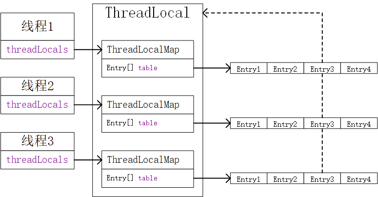

先看下ThreadLocal的基本用法，创建5个线程给同一个ThreadLocal变量设置不同的值，从打印结果看每个线程设置和获取的值都是不同的，可见ThreadLocal为线程安全的，每个线程保存的值相互独立。
```java
public class ThreadLocalTest {
    public static ThreadLocal local = new ThreadLocal();
    public static void main(String[] args) {
        for (int i = 0; i < 5; i++){
            new Thread(new Runnable() {
                @Override
                public void run() {
                    local.set("hello" + Thread.currentThread());
                    System.out.println(local.get());
                }
            }).start();
        }
    }
}
//打印结果为:
helloThread[Thread-4,5,main]
helloThread[Thread-3,5,main]
helloThread[Thread-2,5,main]
helloThread[Thread-0,5,main]
helloThread[Thread-1,5,main]
```
现在开始ThreadLocal的原理，过程比较复杂。首先看下ThreadLocal的set()方法存数据的过程，获取调用set方法的线程中持有的ThreadLocalMap(`ThreadLocal.ThreadLocalMap threadLocals = null;`)，每个线程的ThreadLocalMap都是独立的，因此存储的值是不同的。
```java
    public void set(T value) {
        Thread t = Thread.currentThread();
        ThreadLocalMap map = getMap(t);
        if (map != null) {
            map.set(this, value);
        } else {
            createMap(t, value);
        }
    }
    // 获取线程内置的ThreadLocalMap
    ThreadLocalMap getMap(Thread t) {
        return t.threadLocals;
    }    
```
如果在一个线程中首次使用ThreadLocal保持数据，则需要创建ThreadLocalMap，ThreadLocalMap中保存数据的实体是Entry，保存数据的过程就是先计算这个ThreadLocal对象的hashcode，根据hashcode计算在Entry数组中的位置，然后将创建的Entry保存在这个位置。可以看到Entry中维护的是指向ThreadLocal的弱引用，之所以是弱引用，是因为代码块中ThreadLocal临时变量不再被访问时，在只有Entry的弱引用情况是会被gc的，如果是强引用则不会被gc，即使ThreadLocal不再被访问也不会被gc。
```java
    void createMap(Thread t, T firstValue) {
        t.threadLocals = new ThreadLocalMap(this, firstValue);
    }
        ThreadLocalMap(ThreadLocal<?> firstKey, Object firstValue) {
            //INITIAL_CAPACITY=16
            //初始容量为16，与运算计算索引时就是跟15(1111)取与，由hash值决定结果
            //而ThreadLocal的哈希值由魔数0x61c88647维护，出现哈希碰撞的概率极低
            table = new Entry[INITIAL_CAPACITY];
            int i = firstKey.threadLocalHashCode & (INITIAL_CAPACITY - 1);
            table[i] = new Entry(firstKey, firstValue);
            size = 1;
            setThreshold(INITIAL_CAPACITY);
        }
        // 弱引用
        static class Entry extends WeakReference<ThreadLocal<?>> {
            /** The value associated with this ThreadLocal. */
            Object value;

            Entry(ThreadLocal<?> k, Object v) {
                super(k);
                value = v;
            }
        }        
```
调用set()设置值的时候，会根据ThreadLocal计算hashcode。ThreadLocal中的属性threadLocalHashCode`private final int threadLocalHashCode = nextHashCode();`用来维护每个ThreadLocal的hash值。再根据hashcode计算Entry数组的索引，根据索引找到当前线程对应的Entry，这里分三种情况：
1. 第一次设值，则直接添加如果是当前线程使用的ThreadLocal`if (k == key)`，则将对象设置进来，即写到存储数据的Entry中  
2. ThreadLocal`if (k == key)`已经有值了，就直接更新
3. `if (k == null)`会出现的情况是多个线程同时访问同一个ThreadLocal时，有个线程用完ThreadLocal然后置为null，第二个线程set时就会发现Entry中保存的ThreadLocal为null，而Entry却还存在但是无法被访问，进而出现内存泄漏，此时需要清理无效的过期Entry`replaceStaleEntry`。  


set()时如果发现hash冲突，ThreadLocal的做法是向后移动一位，到数组的下个索引处保存Entry，如果下个索引处有值了再继续向后找。
```java
        private void set(ThreadLocal<?> key, Object value) {
            Entry[] tab = table;
            int len = tab.length;
            int i = key.threadLocalHashCode & (len-1);

            for (Entry e = tab[i];
                 e != null;
                 e = tab[i = nextIndex(i, len)]) {
                ThreadLocal<?> k = e.get();
// 更新
                if (k == key) {
                    e.value = value;
                    return;
                }
// 临时ThreadLocal被回收的处理
                if (k == null) {
                    replaceStaleEntry(key, value, i);
                    return;
                }
            }
// 第一次直接设置
            tab[i] = new Entry(key, value);
            int sz = ++size;
            if (!cleanSomeSlots(i, sz) && sz >= threshold)
                rehash();
        }
        // 向后移动一位
        private static int nextIndex(int i, int len) {
            return ((i + 1 < len) ? i + 1 : 0);
        }
```
当通过get()方法获取数据时，首先找到当前的线程对象，获取线程对象内部的ThreadLocalMap，然后根据ThreadLocal对象计算Entry的索引，找到本线程存储数据的Entry，获取Entry中的数据。
```java
    public T get() {
        Thread t = Thread.currentThread();
        ThreadLocalMap map = getMap(t);
        if (map != null) {
            ThreadLocalMap.Entry e = map.getEntry(this);
            if (e != null) {
                @SuppressWarnings("unchecked")
                T result = (T)e.value;
                return result;
            }
        }
        return setInitialValue();
    }
        private Entry getEntry(ThreadLocal<?> key) {
            int i = key.threadLocalHashCode & (table.length - 1);
            Entry e = table[i];
            if (e != null && e.get() == key)
                return e;
            else
                return getEntryAfterMiss(key, i, e);
        }
```
+ ThreadLocal内存泄漏的问题  
可以看到Entry是指向ThreadLocal的弱引用，弱引用不会阻止gc的垃圾回收，如果这个ThreadLocal对象置为null，指向ThreadLocal对象的弱引用不会阻止gc的垃圾回收，此时ThreadLocal对象会被gc回收，通过get()方法获取value时需要计算ThreadLocal对象的hashcode，在ThreadLocal对象被回收的情况就无法计算hashcode，也就无法访问这个value引用的对象，于是value就成了有引用链但是无法被访问的内存，即造成内存泄漏了。
```java
        static class Entry extends WeakReference<ThreadLocal<?>> {
            /** The value associated with this ThreadLocal. */
            Object value;

            Entry(ThreadLocal<?> k, Object v) {
                super(k);
                value = v;
            }
        }
```
解决方法：
1. 将ThreadLocal变量定义成private static，这样就一直存在ThreadLocal的强引用，可以通过ThreadLocal对象访问到保存的数据，不会造成内存泄漏
2. 调用remove()方法清除内存
```java
     public void remove() {
         ThreadLocalMap m = getMap(Thread.currentThread());
         if (m != null) {
             m.remove(this);
         }
     }
        private void remove(ThreadLocal<?> key) {
            Entry[] tab = table;
            int len = tab.length;
            int i = key.threadLocalHashCode & (len-1);
            for (Entry e = tab[i];
                 e != null;
                 e = tab[i = nextIndex(i, len)]) {
                if (e.get() == key) {
                    e.clear();
                    expungeStaleEntry(i);
                    return;
                }
            }
        }
```
**总结一下，每个ThreadLocal都有每个线程对应的ThreadLocalMap用于保存数据，每个线程的ThreadLocalMap对象都不相同，所以是线程安全的。ThreadLocal存在内存泄漏问题，需要持有ThreadLocal的强引用或remove清理。有不对的地方请大神指出，欢迎大家一起讨论交流，共同进步，更多请关注微信公众号 葡萄开源**