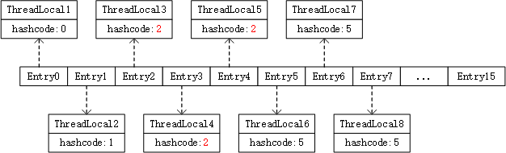

之前看过ThreadLocal保存值的代码，保存的时候会计算数据在数组中的索引`int i = key.threadLocalHashCode & (len-1);`，但是数组的长度有限的，如果有很多个ThreadLocal变量时，就有可能出现哈希冲突，即计算出来的索引相同。比如Entry数组的长度是8，而我们声明了9个ThreadLocal变量，这样同一个线程中同时操作这9个ThreadLocal时就会出现哈希碰撞，现在我们看下Java如何解决ThreadLocal的哈希冲突。
```java
        private void set(ThreadLocal<?> key, Object value) {
            Entry[] tab = table;
            int len = tab.length;
            int i = key.threadLocalHashCode & (len-1);
// 从根据hash值计算得到的索引开始向后移动
            for (Entry e = tab[i];
                 e != null;
                 e = tab[i = nextIndex(i, len)]) {
                ThreadLocal<?> k = e.get();

                if (k == key) {
                    e.value = value;
                    return;
                }
                // ThreadLocal被清理了
                if (k == null) {
                    replaceStaleEntry(key, value, i);
                    return;
                }
            }
// 在下个没有Entry的插槽处加入
            tab[i] = new Entry(key, value);
            int sz = ++size;
            if (!cleanSomeSlots(i, sz) && sz >= threshold)
                rehash();
        }
```
这个过程很简单，例如ThreadLocal3和ThreadLocal4的hash散列值都是2，set()时会将ThreadLocal4保存在ThreadLocal3的下一个索引即Entry3处。这样就把哈希冲突的问题解决掉了，但是会有个致命问题：ThreadLocal3和ThreadLocal4对线程1和线程2都可见，线程1调用set()设置过ThreadLocal3的值，用完之后将ThreadLocal3=null了，此时线程2设置ThreadLocal4的值时，就会发现根据hash值计算得到的索引处的Entry内置的ThreadLocal为null，即`if (k == null)`，此时Entry对象仍然存在于堆上，但是内置的ThreadLocal被gc成null，而我们正是根据ThreadLocal计算hash值访问Entry的，是不是就出现无法访问到的内存，即内存泄漏，Java通过replaceStaleEntry()解决内存泄漏的。  
  
首先沿着需要清理的Entry处向前遍历，找到数组中最靠前的Entry，记录到slotToExpunge，目的是一次性把整个数组清理干净。接下来先解决哈希冲突，沿着待清理的staleSlot处向后遍历，如果发现Entry能够`if (k == key)`保存set()的值就保存下来，同时将待清理的插槽和存在值的插槽交换位置，目的是前移Entry插槽，这样下次get()获取时可以减少nextIndex遍历次数。向后遍历时找到要清理的Entry时就会用slotToExpunge记录下来，解决掉哈希冲突后就会从slotToExpunge处开始清理。例如，ThreadLocal3、ThreadLocal4、ThreadLocal5发生哈希冲突，ThreadLocal4被gc成null了，调用ThreadLocal5的set()方法时发现ThreadLocal4需要被清理，于是进入replaceStaleEntry()清理Entry，向前遍历发现前面的Entry都是正常，于是向后遍历，找到ThreadLocal5对应的Entry在Entry4处，就会保存值，同时将ThreadLocal5和要清理的ThreadLocal4对应的Entry3交换位置，这样下次get()时就可以减少一次nextIndex遍历。
```java
        private void replaceStaleEntry(ThreadLocal<?> key, Object value,
                                       int staleSlot) {
            Entry[] tab = table;
            int len = tab.length;
            Entry e;

            int slotToExpunge = staleSlot;
            //向前遍历数组，找到最开始要清理的Entry
            for (int i = prevIndex(staleSlot, len);
                 (e = tab[i]) != null;
                 i = prevIndex(i, len))
                if (e.get() == null)
                    slotToExpunge = i;

            for (int i = nextIndex(staleSlot, len);
                 (e = tab[i]) != null;
                 i = nextIndex(i, len)) {
                ThreadLocal<?> k = e.get();
            // 匹配到能够保存值的Entry就保存set()的值，k == key默认按hash值比较
                if (k == key) {
                    e.value = value;
                    //交换位置，将待清理的插槽和存在值的插槽交换位置
                    //目的是前移Entry插槽，这样下次get()获取时可以减少nextIndex遍历次数
                    tab[i] = tab[staleSlot];
                    tab[staleSlot] = e;
                    //如果沿staleSlot向前发现没有需要清理的Entry，但是现在发现了，就及时记录
                    //这样slotToExpunge始终为数组中最靠前的Entry
                    if (slotToExpunge == staleSlot)
                        slotToExpunge = i;
                    cleanSomeSlots(expungeStaleEntry(slotToExpunge), len);
                    return;
                }
                //如果沿staleSlot向前发现没有需要清理的Entry，但是现在发现了，就及时记录
                //这样slotToExpunge始终为数组中最靠前的Entry
                if (k == null && slotToExpunge == staleSlot)
                    slotToExpunge = i;
            }
            // 如果在Entry数组中没发现能更新值的位置
            tab[staleSlot].value = null;
            tab[staleSlot] = new Entry(key, value);
            // 向前或向后遍历中发现存在要清理的Entry
            if (slotToExpunge != staleSlot)
                cleanSomeSlots(expungeStaleEntry(slotToExpunge), len);
        }
```
再看下如何清理掉过期的Entry，沿staleSlot向后遍历，发现有内置的ThreadLocal对象为null时清理掉，同时找出存在哈希冲突的ThreadLocal，判断是否存在hash冲突`if (h != i)`的逻辑很简单，不存在时`k.threadLocalHashCode & (len - 1)`计算出来的值跟数组的索引i相等，发现不相等必然存在哈希冲突，将此处的Entry向前移动。例如ThreadLocal6=null、ThreadLocal7、ThreadLocal8的哈希值都是5，现在先将staleSlot=5处的插槽清理掉，再向后移动，发现ThreadLocal7存在哈希碰撞，保存在Entry6处(本来应该保存在5&8=5处)，就将ThreadLocal7移动到ThreadLocal6对应的Entry5处，同时令Entry6=null；下次迭代到ThreadLocal8,发现又存在哈希碰撞，此时移动保存ThreadLocal8的Entry，先打算移动到`int h = k.threadLocalHashCode & (len - 1);`处，即Entry5处，但是Entry5已经保存ThreadLocal6了`while (tab[h] != null) h = nextIndex(h, len);`，就从Entry5处向后移动，找到下一个空的Entry6处保存，最终实现去掉需要被gc的Entry，同时将存在哈希碰撞的Entry前移。此方法返回到一个为null的Entry索引。
```java
        private int expungeStaleEntry(int staleSlot) {
            Entry[] tab = table;
            int len = tab.length;

            //
            tab[staleSlot].value = null;
            tab[staleSlot] = null;
            size--;

            //沿着staleSlot处向后清理Entry
            Entry e;
            int i;
            for (i = nextIndex(staleSlot, len);
                 (e = tab[i]) != null;
                 i = nextIndex(i, len)) {
                ThreadLocal<?> k = e.get();
                //发现Entry内置的ThreadLocal弱引用被gc，则手动清理Entry
                if (k == null) {
                    e.value = null;
                    tab[i] = null;
                    size--;
                } else {
                    //发现存在哈希冲突时将Entry迁移
                    int h = k.threadLocalHashCode & (len - 1);
                    if (h != i) {
                        //因为要将i处的Entry前移，所以i处的Entry将置为null，i处的Entry引用保存在e变量
                        tab[i] = null;

                        // 找到发生哈希碰撞处最靠前的地方
                        while (tab[h] != null)
                            h = nextIndex(h, len);
                        tab[h] = e;
                    }
                }
            }
            return i;
        }
```
刚才说到清理时遇到为null的Entry就会跳出expungeStaleEntry方法，但是Entry数组里还有需要清理的Entry怎么办，需要在cleanSomeSlots处继续处理。这里采用渐进衰减的局部清理策略，发现不存在Entry需要处理就右移一位能够减少很多次无用的迭代。
```java
        private boolean cleanSomeSlots(int i, int n) {
            boolean removed = false;
            Entry[] tab = table;
            int len = tab.length;
            do {
                i = nextIndex(i, len);
                Entry e = tab[i];
                //Entry存在但是用来访问Entry的ThreadLocal不存在
                if (e != null && e.get() == null) {
                    //发现Entry需要被清理就奖励一次，这样每次发现Entry要被清理就会一直循环，直到清理完
                    n = len;
                    removed = true;
                    i = expungeStaleEntry(i);
                }
                //每次右移一位
            } while ( (n >>>= 1) != 0);
            return removed;
        }
```
最后set()时发现容量超出需要扩容了，通过resize()方法实现的，逻辑很简单，新数组默认为原数组的2倍，发现存在`if (k == null)`时则清理ThreadLocal保存的值，老表中的ThreadLocal存在，跟新表计算索引`int h = k.threadLocalHashCode & (newLen - 1);`，保存到新表，发现哈希冲突则向后移动。
```java
        private void resize() {
            Entry[] oldTab = table;
            int oldLen = oldTab.length;
            int newLen = oldLen * 2;
            Entry[] newTab = new Entry[newLen];
            int count = 0;

            for (int j = 0; j < oldLen; ++j) {
                Entry e = oldTab[j];
                if (e != null) {
                    ThreadLocal<?> k = e.get();
                    if (k == null) {
                        e.value = null; // Help the GC
                    } else {
                        int h = k.threadLocalHashCode & (newLen - 1);
                        while (newTab[h] != null)
                            h = nextIndex(h, newLen);
                        newTab[h] = e;
                        count++;
                    }
                }
            }

            setThreshold(newLen);
            size = count;
            table = newTab;
        }
```
**总结下，ThreadLocal出现哈希碰撞时会将数据保存在数组的下个索引处，并清理过期Entry避免内存泄漏，同时将哈希碰撞处的Entry向前移动，这个过程非常繁琐。所以我们尽量不要定义太多ThreadLocal，不要声明临时ThreadLocal变量，也不要轻易将ThreadLocal置为null。有不对的地方请大神指出，欢迎大家一起讨论交流，共同进步，更多请关注微信公众号 葡萄开源**