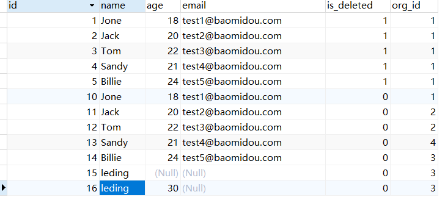
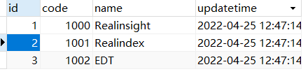
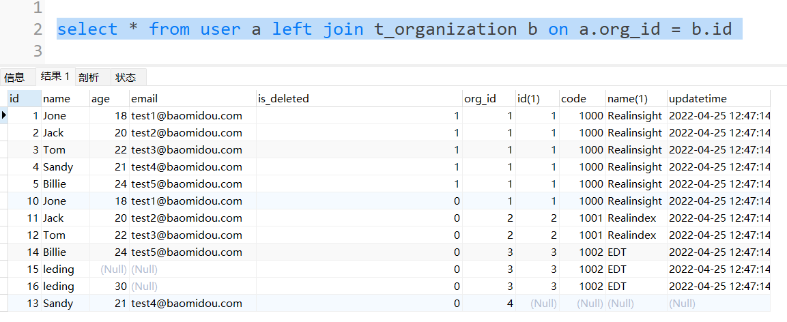
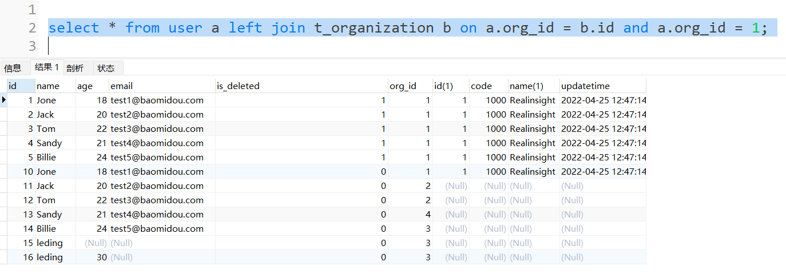

mysql中可以使用left join或right join进行多表关联的查询操作，此时可以在on的关联条件后面添加and作为数据的筛选条件，mysql的处理方式就是先返回左表的所有数据，再按照关联条件on返回满足关联条件的右表数据，放在左表的右边，再按照and的条件进行筛选，如果不满足and的条件就把右表的数据置为null。  
举个例子来看,首先看user表中所有的数据，  
  

再看t_organization表中的所有数据，  
  

当使用left join进行做关联时，如果只有on的关联条件返回的数据如下：  
  
可以看到返回了左表所有数据以及满足关联条件的右表数据，如果不满足关联条件则右表返回null。如果再加上and呢，先看下数据：  
  
其实结论就跟我之前说的那样，加上and后只会对右表数据进行筛选，如果不满足条件右表就返回null，对左表是没有影响的。