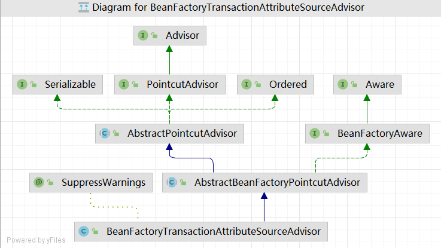

---
title: 事务1-初始化
tags:
notebook: spring源码解析
---

+ 后置处理器的初始化：对主类使用@EnableTransactionManagement注解，@EnableTransactionManagement注解包含@Import(TransactionManagementConfigurationSelector.class)注解，因此对主类处理时会导入@Import注解指定的组件。
  1. 主类上包含@Component注解，因从会被当成组件处理
  2. 对主类组件处理，发现主类存在@Import注解，于是处理@Import
  3. 处理@Import注解时会生成相应的bean的定义，此时@EnableTransactionManagement注解中包含的@Import(TransactionManagementConfigurationSelector.class)注解会被处理
    1. TransactionManagementConfigurationSelector组件实现了selectImports接口
    2. spring以反射方式生成组件的实例对象
    3. 再以反射方式调用实现的selectImports方法
    4. selectImports方法中返回了要实例化的两个组件:AutoProxyRegistrar、ProxyTransactionManagementConfiguration
  4. AutoProxyRegistrar实现了ImportBeanDefinitionRegistrar接口中的registerBeanDefinitions方法，会向容器注册名为"org.springframework.aop.config.internalAutoProxyCreator"，类型为InfrastructureAdvisorAutoProxyCreator的bean定义，InfrastructureAdvisorAutoProxyCreator是bean的后置处理器，在registerBeanPostProcessors方法中生成bean，作为bean的后置处理器保存到CopyOnWriteArrayList，之后会在创建bean的过程中起作用
  5. ProxyTransactionManagementConfiguration组件中使用@Bean注解生成了BeanFactoryTransactionAttributeSourceAdvisor、TransactionAttributeSource、TransactionInterceptor三个组件
+ 获取增强器：InfrastructureAdvisorAutoProxyCreator继承的AbstractAutoProxyCreator类实现了InstantiationAwareBeanPostProcessor接口，在创建bean之前，postProcessBeforeInstantiation方法会被调用。
  1. 获取缓存key，根据key判断当前bean是否已经被增强，防止重复增强
  2. 判断当前bean是否为基础bean，不会对基础bean进行增强
  3. 获取增强器
     1. 从容器中找到实现了Advisor接口的bean，这种bean会被当作增强器处理。在后置处理器的初始化过程中生成了BeanFactoryTransactionAttributeSourceAdvisor，这个bean实现了Advisor接口，其name为"org.springframework.transaction.config.internalTransactionAdvisor"，将bean name缓存下来，之后直接从缓存获取
     2. 判断获取到的增强器是否就是当前正在创建的bean，如果是直接跳过不作任何处理
+ 生成代理对象：在创建bean的实例对象，对bean的属性进行填充之后，事务模块的后置处理器就会起作用，对目标方法进行增强。
1. 从容器内获取增强器后，判断能否应用到当前的bean
   1. 先对引介增强器进行处理，当前的增强器为普通增强器
   2. 事务增强器实现了PointcutAdvisor，实例化BeanFactoryTransactionAttributeSourceAdvisor的时候，会
   `private final TransactionAttributeSourcePointcut pointcut = new TransactionAttributeSourcePointcut()`生成切点表达式，现在要获取切点表达式
   1. 遍历bean的Class中的所有方法，判断能否对当前方法进行增强，如果能获取到事务属性表示使用@Transactional注解，就能增强
      1. 不可以为Object对象中的方法增强
      2. 从缓存中获取方法的事务属性，如果能获取到表明当前的方法使用了@Transactional注解，存在事务属性，否则对方法进行解析
      3. 方法必须是public的
      4. 先从方法上寻找@Transactional注解，再从方法所在的类上寻找，再到类实现的接口上找，找到为止
      5. 通过[parseTransactionAnnotation](#parsetransactionannotation)方法对@Transactional进行解析，将注解元数据封装成TransactionAttribute对象
      6. 解析完成后将方法和事务属性的映射关系保存到ConcurrentHashMap中，当然得通过MethodClassKey对方法进行封装，需要重写hasCode方法
   2. 返回能对目标bean进行增强的增强器
   3. 如果找到了增强器，则会使用jdk动态代理或cglib动态代理生成代理对象

```
>AbstractApplicationContext.java#refresh
>AbstractApplicationContext.java#invokeBeanFactoryPostProcessors
>PostProcessorRegistrationDelegate.java#invokeBeanFactoryPostProcessors
>PostProcessorRegistrationDelegate.java#invokeBeanDefinitionRegistryPostProcessors
>ConfigurationClassParser.java#parse
>ConfigurationClassParser.java#processConfigurationClass
protected String[] selectImports(AdviceMode adviceMode) {
    switch (adviceMode) {
        case PROXY:
            return new String[] {AutoProxyRegistrar.class.getName(),
                    ProxyTransactionManagementConfiguration.class.getName()};
        case ASPECTJ:
            return new String[] {determineTransactionAspectClass()};
        default:
            return null;
    }
}
```
```
public static boolean canApply(Pointcut pc, Class<?> targetClass, boolean hasIntroductions) {
    Assert.notNull(pc, "Pointcut must not be null");
    if (!pc.getClassFilter().matches(targetClass)) {
        return false;
    }
//getMethodMatcher会返回pc实例对象
    MethodMatcher methodMatcher = pc.getMethodMatcher();
    if (methodMatcher == MethodMatcher.TRUE) {
        // No need to iterate the methods if we're matching any method anyway...
        return true;
    }

    IntroductionAwareMethodMatcher introductionAwareMethodMatcher = null;
    if (methodMatcher instanceof IntroductionAwareMethodMatcher) {
        introductionAwareMethodMatcher = (IntroductionAwareMethodMatcher) methodMatcher;
    }

    Set<Class<?>> classes = new LinkedHashSet<>();
    if (!Proxy.isProxyClass(targetClass)) {
        classes.add(ClassUtils.getUserClass(targetClass));
    }
    classes.addAll(ClassUtils.getAllInterfacesForClassAsSet(targetClass));

    for (Class<?> clazz : classes) {
        Method[] methods = ReflectionUtils.getAllDeclaredMethods(clazz);
        for (Method method : methods) {
            if (introductionAwareMethodMatcher != null ?
                    introductionAwareMethodMatcher.matches(method, targetClass, hasIntroductions) :
                    methodMatcher.matches(method, targetClass)) {
                return true;
            }
        }
    }

    return false;
}

public final MethodMatcher getMethodMatcher() {
    return this;
}
```
# parseTransactionAnnotation
```
protected TransactionAttribute parseTransactionAnnotation(AnnotationAttributes attributes) {
    RuleBasedTransactionAttribute rbta = new RuleBasedTransactionAttribute();

    Propagation propagation = attributes.getEnum("propagation");
    rbta.setPropagationBehavior(propagation.value());
    Isolation isolation = attributes.getEnum("isolation");
    rbta.setIsolationLevel(isolation.value());
    rbta.setTimeout(attributes.getNumber("timeout").intValue());
    rbta.setReadOnly(attributes.getBoolean("readOnly"));
    rbta.setQualifier(attributes.getString("value"));

    List<RollbackRuleAttribute> rollbackRules = new ArrayList<>();
    for (Class<?> rbRule : attributes.getClassArray("rollbackFor")) {
        rollbackRules.add(new RollbackRuleAttribute(rbRule));
    }
    for (String rbRule : attributes.getStringArray("rollbackForClassName")) {
        rollbackRules.add(new RollbackRuleAttribute(rbRule));
    }
    for (Class<?> rbRule : attributes.getClassArray("noRollbackFor")) {
        rollbackRules.add(new NoRollbackRuleAttribute(rbRule));
    }
    for (String rbRule : attributes.getStringArray("noRollbackForClassName")) {
        rollbackRules.add(new NoRollbackRuleAttribute(rbRule));
    }
    rbta.setRollbackRules(rollbackRules);

    return rbta;
}
```