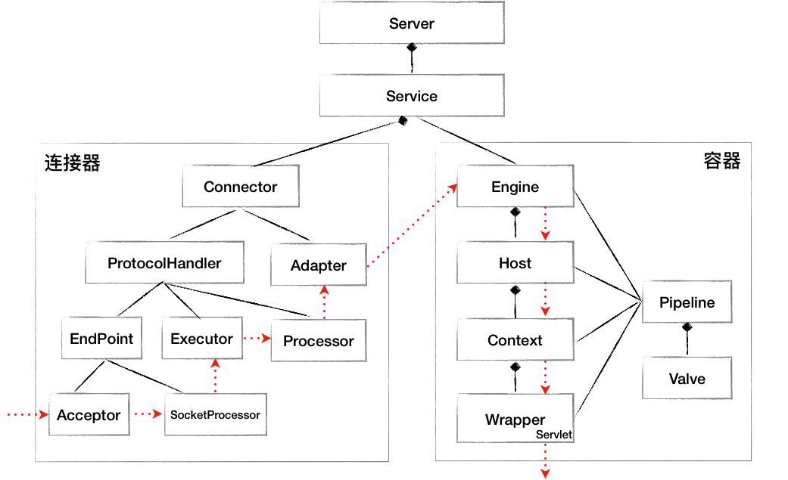

tomcat服务器启动是从`Bootstrap`的`main()`方法开始的，所以要了解tomcat的启动过程，就要从这里开始看起。  
首先实例化Bootstrap，然后在`init()`初始化tomcat专用的类加载器。接下来就会进入tomcat的启动流程了，先看connector连接器的启动过程。
```java
public static void main(String args[]) {

        synchronized (daemonLock) {
            if (daemon == null) {
                Bootstrap bootstrap = new Bootstrap();
                try {
                    bootstrap.init();
                } catch (Throwable t) {
                    handleThrowable(t);
                    log.error("Init exception", t);
                    return;
                }
                daemon = bootstrap;
            } else {
                Thread.currentThread().setContextClassLoader(daemon.catalinaLoader);
            }
        }

        try {
            String command = "start";
            ... else if (command.equals("start")) {
                daemon.setAwait(true);
                //解析server.xml，组件实例化
                daemon.load(args);
                //启动所有组件
                daemon.start();
                if (null == daemon.getServer()) {
                    System.exit(1);
                }
            } ...
        } catch (Throwable t) {
            ...
        }
    }
```
`load()`中会以反射的形式调用`Catalina`类的`load()`方法。这个方法的逻辑就是解析server.xml文件，生成对应的组件，然后通过组合模式调用每个组件的`init()`方法。
```java
    public void load() {

        ......
        parseServerXml(true);
        Server s = getServer();
        ......
        try {
            getServer().init();
        } catch (LifecycleException e) {
            ......
        }
.....
    }
```
+ 解析xml文件生成组件  
可以看到先获取server.xml文件的路径，然后通过Digester工具对xml文件进行解析，生成相应的组件，Digester是个可以解析xml然后直接生成对象的工具。
```java
    protected void parseServerXml(boolean start) {
        ......
            try (ConfigurationSource.Resource resource = ConfigFileLoader.getSource().getServerXml()) {
                // Create and execute our Digester
                Digester digester = start ? createStartDigester() : createStopDigester();
                InputStream inputStream = resource.getInputStream();
                InputSource inputSource = new InputSource(resource.getURI().toURL().toString());
                inputSource.setByteStream(inputStream);
                digester.push(this);
                if (generateCode) {
                    digester.startGeneratingCode();
                    generateClassHeader(digester, start);
                }
                digester.parse(inputSource);
                ......
        }
    }

```
使用Digester解析xml文件的逻辑很简单，先定义需要忽略的属性，然后配置相关的xml文件节点到Java对象的映射，最后解析就行。
```java
protected Digester createStartDigester() {
        // Initialize the digester
        Digester digester = new Digester();
        ......
        // 定义忽略的属性
        digester.setFakeAttributes(fakeAttributes);
        digester.setUseContextClassLoader(true);

        // 解析 server.xml 文件，首先生成 StandardServer 对象，调用 当前对象的 setServer 方法设置进行
        // 再解析 Server/GlobalNamingResources 标签，生成 NamingResourcesImpl 对象，调用 StandardServer 的 setGlobalNamingResources 设置到 Server
        // 如果 Server 标签中有 className 属性，则使用 className 属性创建对象，否则默认使用 org.apache.catalina.core.StandardServer
        digester.addObjectCreate("Server", "org.apache.catalina.core.StandardServer", "className");
        // 读取 Server 标签下的属性到 Server 对象中
        digester.addSetProperties("Server");
        digester.addSetNext("Server", "setServer", "org.apache.catalina.Server");

        ......

        return digester;

    }
```
+ 组件初始化  
组件实例化之后就会以组合模式调用每个组件的`init()`方法，这里用到了Java中的组合模式，可以先看下组件之间的关系。，调用`init()`时是从父组件Server开始依次调用。`init`方法本身逻辑就是状态变更，从`LifecycleState.INITIALIZING`到`LifecycleState.INITIALIZED`，然后调用模板方法`initInternal();`，因此我们直接看每个组件的模板方法就行。
```java
// LifecycleBase.java
    public final synchronized void init() throws LifecycleException {
        if (!state.equals(LifecycleState.NEW)) {
            invalidTransition(BEFORE_INIT_EVENT);
        }

        try {
            setStateInternal(LifecycleState.INITIALIZING, null, false);
            initInternal();
            setStateInternal(LifecycleState.INITIALIZED, null, false);
        } catch (Throwable t) {
            handleSubClassException(t, "lifecycleBase.initFail", toString());
        }
    }
```
+ StandardServer  
Server就是调用Service子组件的`init()`方法。
```java
    protected void initInternal() throws LifecycleException {

        super.initInternal();

        ......
        // Initialize our defined Services
        for (Service service : findServices()) {
            service.init();
        }
    }
```
+ StandardService  
Service就是调用子组件Connector的`init()`方法
```java
   protected void initInternal() throws LifecycleException {

        super.initInternal();
......

        for (Connector connector : findConnectors()) {
            connector.init();
        }
    }
```
+ Connector  
Connector会先创建一个适配器，然后再调用内部的协议处理器`protected final ProtocolHandler protocolHandler;`的init()方法。
```java
    protected void initInternal() throws LifecycleException {

        super.initInternal();
.....
        // Initialize adapter
        adapter = new CoyoteAdapter(this);
        protocolHandler.setAdapter(adapter);
......
        try {
            protocolHandler.init();
        } catch (Exception e) {
            throw new LifecycleException(sm.getString("coyoteConnector.protocolHandlerInitializationFailed"), e);
        }
    }
```
ProtocolHandler是协议处理器，从协议大类可以分成http和ajp，从io方式可以分成nio和nio2，这个可以在server.xml的Connector标签中通过protocol定义，默认是`protocol="HTTP/1.1"` ，对应的实现是`Http11NioProtocol`，那我们看下`Http11NioProtocol`的`init()`方法就行。  
  
此时会调用继承的父类`AbstractProtocol`中的`init()`方法。
```java
// AbstractProtocol.java
    public void init() throws Exception {
        ......

        String endpointName = getName();
        endpoint.setName(endpointName.substring(1, endpointName.length() - 1));
        endpoint.setDomain(domain);

        endpoint.init();
    }
```
好了，现在到正题了，接下来tomcat就会通过nio监听socket端口了。
```java
    public final void init() throws Exception {
        if (bindOnInit) {
            bindWithCleanup();
            bindState = BindState.BOUND_ON_INIT;
        }
        ......
    }
    private void bindWithCleanup() throws Exception {
        try {
            bind();
        } catch (Throwable t) {
            ......
        }
    }
```
最后会调用到`NioEndpoint`的`initServerSocket`方法，这就是jdk的nio方法调用了，先打开socket通道，然后监听端口，默认是`8080`。
```java
// NioEndpoint
    protected void initServerSocket() throws Exception {
        ...... else {
            serverSock = ServerSocketChannel.open();
            socketProperties.setProperties(serverSock.socket());
            InetSocketAddress addr = new InetSocketAddress(getAddress(), getPortWithOffset());
            serverSock.bind(addr, getAcceptCount());
        }
        serverSock.configureBlocking(true); //mimic APR behavior
    }
```
到这里，组件实例化之后`init()`方法调用就看完了，回到`main`，继续调用每个组件的`start()`方法，最后的核心逻辑也是在`NioEndpoint`，主要做了三件事：
```java
// NioEndpoint
    public void startInternal() throws Exception {

        if (!running) {
            running = true;
            paused = false;

            ....

            // Create worker collection
            if (getExecutor() == null) {
                createExecutor();
            }

            initializeConnectionLatch();

            // Start poller thread
            poller = new Poller();
            Thread pollerThread = new Thread(poller, getName() + "-Poller");
            pollerThread.setPriority(threadPriority);
            pollerThread.setDaemon(true);
            pollerThread.start();

            startAcceptorThread();
        }
    }
```
1. 创建线程池  
tomcat重写了`ThreadPoolExecutor`，定制了一个Queue用于保存任务，默认最大线程数是200。
```java
    public void createExecutor() {
        internalExecutor = true;
        if (getUseVirtualThreads()) {
            executor = new VirtualThreadExecutor(getName() + "-virt-");
        } else {
            TaskQueue taskqueue = new TaskQueue();
            TaskThreadFactory tf = new TaskThreadFactory(getName() + "-exec-", daemon, getThreadPriority());
            executor = new ThreadPoolExecutor(getMinSpareThreads(), getMaxThreads(), getThreadsMaxIdleTime(),
                    TimeUnit.MILLISECONDS, taskqueue, tf);
            taskqueue.setParent((ThreadPoolExecutor) executor);
        }
    }
```
2. 创建Poller线程处理socket读写事件  
这里会调用`select()`方法获取具有事件的socket，然后依次遍历，调用`processKey()`方法对每个socket进行处理。
```java
        public void run() {
            // Loop until destroy() is called
            while (true) {

                boolean hasEvents = false;

                try {
                    if (!close) {
                        hasEvents = events();
                        if (wakeupCounter.getAndSet(-1) > 0) {
                            // If we are here, means we have other stuff to do
                            // Do a non blocking select
                            keyCount = selector.selectNow();
                        } else {
                            keyCount = selector.select(selectorTimeout);
                        }
                        wakeupCounter.set(0);
                    }
                    if (close) {
                        events();
                        timeout(0, false);
                        try {
                            selector.close();
                        } catch (IOException ioe) {
                            log.error(sm.getString("endpoint.nio.selectorCloseFail"), ioe);
                        }
                        break;
                    }
                    // Either we timed out or we woke up, process events first
                    if (keyCount == 0) {
                        hasEvents = (hasEvents | events());
                    }
                } catch (Throwable x) {
                    ExceptionUtils.handleThrowable(x);
                    log.error(sm.getString("endpoint.nio.selectorLoopError"), x);
                    continue;
                }

                Iterator<SelectionKey> iterator =
                    keyCount > 0 ? selector.selectedKeys().iterator() : null;
                // Walk through the collection of ready keys and dispatch
                // any active event.
                while (iterator != null && iterator.hasNext()) {
                    SelectionKey sk = iterator.next();
                    iterator.remove();
                    NioSocketWrapper socketWrapper = (NioSocketWrapper) sk.attachment();
                    // Attachment may be null if another thread has called
                    // cancelledKey()
                    if (socketWrapper != null) {
                        processKey(sk, socketWrapper);
                    }
                }

                // Process timeouts
                timeout(keyCount,hasEvents);
            }

            getStopLatch().countDown();
        }

```
3. 启动accept线程监听socket连接  
这就是我们经常看到的nio的accept方法调用，监听来自客户端的socket连接。
```java 
    protected void startAcceptorThread() {
        acceptor = new Acceptor<>(this);
        String threadName = getName() + "-Acceptor";
        acceptor.setThreadName(threadName);
        Thread t = new Thread(acceptor, threadName);
        t.setPriority(getAcceptorThreadPriority());
        t.setDaemon(getDaemon());
        t.start();
    }

    public void run() {

        try {
            while (!stopCalled) {

                try {
                    ......

                    U socket = null;
                    try {
                        socket = endpoint.serverSocketAccept();
                    } catch (Exception ioe) {
                        ......
                    }
                   ......
                }
            }
        } finally {
            stopLatch.countDown();
        }
        state = AcceptorState.ENDED;
    }   

    protected SocketChannel serverSocketAccept() throws Exception {
        SocketChannel result = serverSock.accept();

        // Bug does not affect Windows platform and Unix Domain Socket. Skip the check.
        if (!JrePlatform.IS_WINDOWS && getUnixDomainSocketPath() == null) {
            SocketAddress currentRemoteAddress = result.getRemoteAddress();
            long currentNanoTime = System.nanoTime();
            if (currentRemoteAddress.equals(previousAcceptedSocketRemoteAddress) &&
                    currentNanoTime - previousAcceptedSocketNanoTime < 1000) {
                throw new IOException(sm.getString("endpoint.err.duplicateAccept"));
            }
            previousAcceptedSocketRemoteAddress = currentRemoteAddress;
            previousAcceptedSocketNanoTime = currentNanoTime;
        }

        return result;
    }     
```
再看下Engine容器的启动过程。在`Catalina`的`createStartDigester()`方法中会添加Engine的生成规则`digester.addRuleSet(new EngineRuleSet("Server/Service/"));`，在EngineRuleSet.java中会调用`addRuleInstances`添加Engine的生成规则`digester.addObjectCreate(prefix + "Engine", "org.apache.catalina.core.StandardEngine", "className");`，可以看到默认为org.apache.catalina.core.StandardEngine。在Service的`init`方法中会调用StandardEngine的init方法，