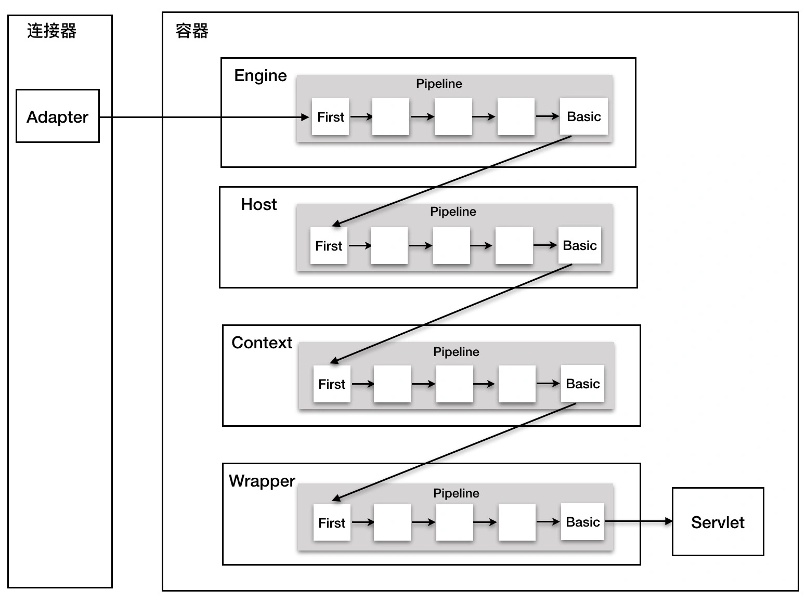
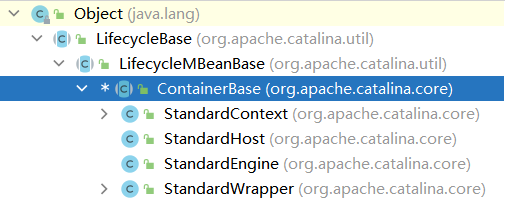

上一节说到请求url定位servlet的过程，tomcat会把请求url和容器的映射关系保存到MappingData中，org.apache.catalina.connector.Request类实现了HttpServletRequest，其中定义了属性mappingData`protected final MappingData mappingData = new MappingData();`用于保存映射关系，其是在`CoyoteAdapter.java#service()`方法中创建。定位servlet对请求进行处理的入口是`connector.getService().getContainer().getPipeline().getFirst().invoke(request, response);`，先看张图总览下处理过程。

这里的逻辑就是调用Pipeline中的每个Valve进行处理。在`ContainerBase.java`抽象父类中声明了属性`protected final Pipeline pipeline = new StandardPipeline(this);`，意味着`ContainerBase`的子类都会有一个管道`Pipeline(StandardPipeline)`，查看类的继承关系可知，tomcat中ContainerBase的子类有四个：`StandardEngine`、`StandardHost`、`StandardContext`、`StandardWrapper`。  

+ StandardEngine  
通过`connector.getService().getContainer().getPipeline()`获取到`Engine(StandardEngine)`容器，再通过`getPipeline().getFirst()`获取`Pipeline(StandardPipeline.java)`中的第一个`Valve`，即使用StandardEngine中的StandardPipeline的第一个Valve进行处理，接下来看下这个Valve怎么来的。在`Valve`中有个属性`protected Valve next = null;`，用来指向下一个`Valve`，这就构建了一个链表，`getFirst()`时发现链条为空，则默认获取`basic`，而StandardEngine的pipeline中的basic是在StandardEngine的构造函数中生成的。
```java
    public Valve getFirst() {
        if (first != null) {
            return first;
        }

        return basic;
    }
    public StandardEngine() {
        pipeline.setBasic(new StandardEngineValve());
        ......
    }
    public void setBasic(Valve valve) {
......
        Valve current = first;
        while (current != null) {
            if (current.getNext() == oldBasic) {
                current.setNext(valve);
                break;
            }
            current = current.getNext();
        }

        this.basic = valve;
    }

```
搞清楚了这个Valve的由来了，再看他的处理逻辑：就是找到前面通过请求url定位的Host，获取Host的Valve进行处理。
```java
    public void invoke(Request request, Response response) throws IOException, ServletException {
        // Select the Host to be used for this Request
        Host host = request.getHost();
        ......
        host.getPipeline().getFirst().invoke(request, response);
    }

    public Host getHost() {
        return mappingData.host;
    }
}
```
+ StandardHost  
`host.getPipeline().getFirst().invoke(request, response);`的过程类似类似StandardEngine容器。
```java
    public StandardHost() {
        super();
        pipeline.setBasic(new StandardHostValve());

    }
```
不过Host容器的Valve要多一点。首先在server.xml中配置了一个`AccessLogValve`，这个在使用Digester解析时会添加到Host容器的Pipeline，既然是解析xml文件生成，那我们就可以在xml文件中自定义一些Valve了。
```xml
    <Host name="localhost"  appBase="webapps"
            unpackWARs="true" autoDeploy="true">
        <Valve className="org.apache.catalina.valves.AccessLogValve" directory="logs"
               prefix="localhost_access_log" suffix=".txt"
               pattern="%h %l %u %t &quot;%r&quot; %s %b" />

      </Host>
```
同时在启动时会向Pipeline添加一个`ErrorReportValve`。
```java
    protected void startInternal() throws LifecycleException {

        // Set error report valve
        String errorValve = getErrorReportValveClass();
        if ((errorValve != null) && (!errorValve.equals(""))) {
            try {
                boolean found = false;
                Valve[] valves = getPipeline().getValves();
                for (Valve valve : valves) {
                    if (errorValve.equals(valve.getClass().getName())) {
                        found = true;
                        break;
                    }
                }
                if (!found) {
                    Valve valve = ErrorReportValve.class.getName().equals(errorValve) ? new ErrorReportValve() :
                            (Valve) Class.forName(errorValve).getConstructor().newInstance();
                    getPipeline().addValve(valve);
                }
            } catch (Throwable t) {
                ExceptionUtils.handleThrowable(t);
                log.error(sm.getString("standardHost.invalidErrorReportValveClass", errorValve), t);
            }
        }
        super.startInternal();
    }
```
最终tomcat收到请求使用Host容器处理时，就会有三个Valve参与:AccessLogValve->ErrorReportValve->StandardHostValve。
接下来我们一个个看每个Valve的处理过程。
1. AccessLogValve  
好像没做什么正事，之后再看。
```java
    public void invoke(Request request, Response response) throws IOException, ServletException {
        if (tlsAttributeRequired) {
       
            request.getAttribute(Globals.CERTIFICATES_ATTR);
        }
        if (cachedElements != null) {
            for (CachedElement element : cachedElements) {
                element.cache(request);
            }
        }
        getNext().invoke(request, response);
    }
```
2. ErrorReportValve.java  
这是在请求处理完的后置处理，用来报告错误的。
```java
    public void invoke(Request request, Response response) throws IOException, ServletException {

        // Perform the request
        getNext().invoke(request, response);

        if (response.isCommitted()) {
            if (response.setErrorReported()) {
                // Error wasn't previously reported but we can't write an error
                // page because the response has already been committed.

                // See if IO is allowed
                AtomicBoolean ioAllowed = new AtomicBoolean(true);
                response.getCoyoteResponse().action(ActionCode.IS_IO_ALLOWED, ioAllowed);

                if (ioAllowed.get()) {
                    // I/O is currently still allowed. Flush any data that is
                    // still to be written to the client.
                    try {
                        response.flushBuffer();
                    } catch (Throwable t) {
                        ExceptionUtils.handleThrowable(t);
                    }
                    // Now close immediately to signal to the client that
                    // something went wrong
                    response.getCoyoteResponse().action(ActionCode.CLOSE_NOW,
                            request.getAttribute(RequestDispatcher.ERROR_EXCEPTION));
                }
            }
            return;
        }

        Throwable throwable = (Throwable) request.getAttribute(RequestDispatcher.ERROR_EXCEPTION);

        // If an async request is in progress and is not going to end once this
        // container thread finishes, do not process any error page here.
        if (request.isAsync() && !request.isAsyncCompleting()) {
            return;
        }

        if (throwable != null && !response.isError()) {
            // Make sure that the necessary methods have been called on the
            // response. (It is possible a component may just have set the
            // Throwable. Tomcat won't do that but other components might.)
            // These are safe to call at this point as we know that the response
            // has not been committed.
            response.reset();
            response.sendError(HttpServletResponse.SC_INTERNAL_SERVER_ERROR);
        }

        // One way or another, response.sendError() will have been called before
        // execution reaches this point and suspended the response. Need to
        // reverse that so this valve can write to the response.
        response.setSuspended(false);

        try {
            report(request, response, throwable);
        } catch (Throwable tt) {
            ExceptionUtils.handleThrowable(tt);
        }
    }
```
3. StandardHostValve  
没有大的处理，还是把请求向后传递到Context容器的Valve。
```java
public void invoke(Request request, Response response) throws IOException, ServletException {
    Context context = request.getContext();
    ......
        context.getPipeline().getFirst().invoke(request, response);
    ......
}

```
+ StandardContext
在tomcat启动时，`StandardContext#startInternal()`方法会添加一个NonLoginAuthenticator类型Valve到StandardContext的Pipeline中，然后设置`basic(StandardContextValve)`。StandardContextValve从请求中获取StandardWrapperValve进行请求的处理。
+ StandardWrapperValve  
前面铺垫了这么久，总算到正题了，请求的正式处理就是在StandardWrapperValve中进行的，前面的Valve做的还是对请求进行加工，没有进行正式的处理。怎么样，是不是看到熟悉的代码段，平时我们所说的过滤器链对请求过滤处理的代码!这块就是挨个调用每个过滤器Filter上的doFilter()方法进行处理。
```java
    public void invoke(Request request, Response response) throws IOException, ServletException {
    ......
        Servlet servlet = null;
        ......
            servlet = wrapper.allocate();
        ApplicationFilterChain filterChain = ApplicationFilterFactory.createFilterChain(request, wrapper, servlet);
        ......
                        filterChain.doFilter(request.getRequest(), response.getResponse());
                        ......        
    }
```
还是慢慢看吧，首先在Wrapper容器中取出Servlet，然后创建用来处理请求的servlet过滤器链。依次调用每个过滤器的doFilter方法，最后会通过HttpServlet中的模板方法`internalDoFilter()`调用内置的`service`方法，就是根据请求方式处理请求啦，也就是我们写的过滤器中处理请求的方法。
```java
    protected void service(HttpServletRequest req, HttpServletResponse resp) throws ServletException, IOException {

        String method = req.getMethod();

        if (method.equals(METHOD_GET)) {
            long lastModified = getLastModified(req);
            if (lastModified == -1) {
                // servlet doesn't support if-modified-since, no reason
                // to go through further expensive logic
                doGet(req, resp);
            } else {
                long ifModifiedSince;
                try {
                    ifModifiedSince = req.getDateHeader(HEADER_IFMODSINCE);
                } catch (IllegalArgumentException iae) {
                    // Invalid date header - proceed as if none was set
                    ifModifiedSince = -1;
                }
                if (ifModifiedSince < (lastModified / 1000 * 1000)) {
                    // If the servlet mod time is later, call doGet()
                    // Round down to the nearest second for a proper compare
                    // A ifModifiedSince of -1 will always be less
                    maybeSetLastModified(resp, lastModified);
                    doGet(req, resp);
                } else {
                    resp.setStatus(HttpServletResponse.SC_NOT_MODIFIED);
                }
            }

        } else if (method.equals(METHOD_HEAD)) {
            long lastModified = getLastModified(req);
            maybeSetLastModified(resp, lastModified);
            doHead(req, resp);

        } else if (method.equals(METHOD_POST)) {
            doPost(req, resp);

        } else if (method.equals(METHOD_PUT)) {
            doPut(req, resp);

        } else if (method.equals(METHOD_DELETE)) {
            doDelete(req, resp);

        } else if (method.equals(METHOD_OPTIONS)) {
            doOptions(req, resp);

        } else if (method.equals(METHOD_TRACE)) {
            doTrace(req, resp);

        } else {
            //
            // Note that this means NO servlet supports whatever
            // method was requested, anywhere on this server.
            //

            String errMsg = lStrings.getString("http.method_not_implemented");
            Object[] errArgs = new Object[1];
            errArgs[0] = method;
            errMsg = MessageFormat.format(errMsg, errArgs);

            resp.sendError(HttpServletResponse.SC_NOT_IMPLEMENTED, errMsg);
        }
    }
```
**总结下，tomcat使用valve处理请求是请求处理的最后一步。首先启动时会给每个容器的Pipeline添加一个基本valve，放在链条尾部，由这个valve找到下一个容器的valve，用来传递请求，最终传递到StandardWrapperValve后，取出servlet对请求进行处理。有不对的地方请大神指出，欢迎大家一起讨论交流，共同进步。**
