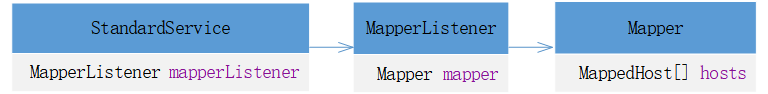
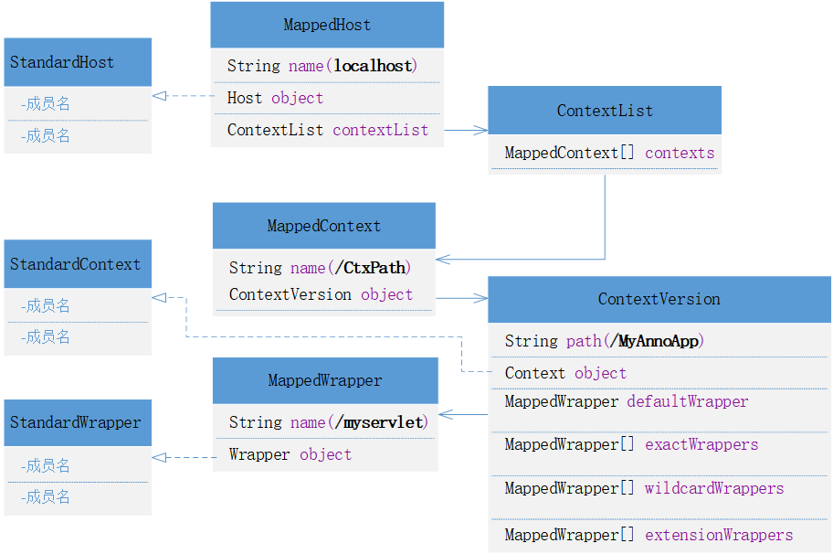

tomcat启动时会调用Lifecycle的start()方法，`MapperListener.java`中的方法`startInternal()`会被调用，此时开始了请求url映射到容器的初始化之路。首先看下`private final Mapper mapper;`属性，这个属性包含了请求url到容器的所有映射关系，其中hosts是Host容器的数组。  

```java
public final class Mapper {
    volatile MappedHost[] hosts = new MappedHost[0];

    private volatile String defaultHostName = null;
    private volatile MappedHost defaultHost = null;
    private final Map<Context,ContextVersion> contextObjectToContextVersionMap = new ConcurrentHashMap<>();
}
```
tomcat中请求url与各容器的映射关系保存在Mapper中的，关系图如下:

在tomcat启动阶段会调用`MapperListener.java`中的模板方法`startInternal()`
```java
    public void startInternal() throws LifecycleException {
......
        Container[] conHosts = engine.findChildren();
        for (Container conHost : conHosts) {
            Host host = (Host) conHost;
            if (!LifecycleState.NEW.equals(host.getState())) {
                // Registering the host will register the context and wrappers
                registerHost(host);
            }
        }
    }

    private void registerHost(Host host) {

        String[] aliases = host.findAliases();
        mapper.addHost(host.getName(), aliases, host);

        for (Container container : host.findChildren()) {
            if (container.getState().isAvailable()) {
                registerContext((Context) container);
            }
        }

        // Default host may have changed
        findDefaultHost();

        if (log.isDebugEnabled()) {
            log.debug(sm.getString("mapperListener.registerHost", host.getName(), domain, service));
        }
    }
```
首先添加host到mapper中，看下这个过程：
```java
    public synchronized void addHost(String name, String[] aliases, Host host) {
        name = renameWildcardHost(name);
        MappedHost[] newHosts = new MappedHost[hosts.length + 1];
        MappedHost newHost = new MappedHost(name, host);
        if (insertMap(hosts, newHosts, newHost)) {
            hosts = newHosts;
            if (newHost.name.equals(defaultHostName)) {
                defaultHost = newHost;
            }
            if (log.isDebugEnabled()) {
                log.debug(sm.getString("mapper.addHost.success", name));
            }
        } else {
            MappedHost duplicate = hosts[find(hosts, name)];
            if (duplicate.object == host) {
                // The host is already registered in the mapper.
                // E.g. it might have been added by addContextVersion()
                if (log.isDebugEnabled()) {
                    log.debug(sm.getString("mapper.addHost.sameHost", name));
                }
                newHost = duplicate;
            } else {
                log.error(sm.getString("mapper.duplicateHost", name, duplicate.getRealHostName()));
                // Do not add aliases, as removeHost(hostName) won't be able to
                // remove them
                return;
            }
        }
        ......
    }
```
使用`MappedHost`去封装`Host`，生成的MappedHost会保存在属性hosts`volatile MappedHost[] hosts = new MappedHost[0];`中，现在在Mapper中有Host了。Host就是主机嘛，映射域名的。Host是由tomcat解析server.xml文件生成，因此我们可以在server.xml文件中配置Host。接下来是注册Context到Host中`registerContext`。Context就是加载servlet的文件夹路径，通过这个路径去匹配Context。
```java
    private void registerContext(Context context) {
......
        List<WrapperMappingInfo> wrappers = new ArrayList<>();
        for (Container container : context.findChildren()) {
            prepareWrapperMappingInfo(context, (Wrapper) container, wrappers);

            if (log.isDebugEnabled()) {
                log.debug(sm.getString("mapperListener.registerWrapper", container.getName(), contextPath, service));
            }
        }

        mapper.addContextVersion(host.getName(), host, contextPath, context.getWebappVersion(), context, welcomeFiles,
                resources, wrappers);

        if (log.isDebugEnabled()) {
            log.debug(sm.getString("mapperListener.registerContext", contextPath, service));
        }
    }

```
+ 使用WrapperMappingInfo封装Wrapper   
使用WrapperMappingInfo去封装mapping映射的请求和Wrapper(`StandardWrapper`)，然后添加到`public MappedWrapper[] exactWrappers = new MappedWrapper[0];`。
```java
    private void prepareWrapperMappingInfo(Context context, Wrapper wrapper, List<WrapperMappingInfo> wrappers) {
        String wrapperName = wrapper.getName();
        boolean resourceOnly = context.isResourceOnlyServlet(wrapperName);
        String[] mappings = wrapper.findMappings();
        for (String mapping : mappings) {
            boolean jspWildCard = (wrapperName.equals("jsp") && mapping.endsWith("/*"));
            wrappers.add(new WrapperMappingInfo(mapping, wrapper, jspWildCard, resourceOnly));
        }
    }
```
+ 添加MappedContext  
这里有点绕，首先在MappedHost中有个`public volatile ContextList contextList;`，contextList`contextList`中有个contexts`public final MappedContext[] contexts;`用来存储`MappedContext`，这里先用`ContextVersion`封装`Context`，再用`MappedContext`封装ContextVersion，然后保存到MappedHost中。可以看到ContextVersion是包含请求路径的，因此tomcat收到请求时可以根据url定位到对应的ContextVersion。
```java
    public void addContextVersion(String hostName, Host host, String path, String version, Context context,
            String[] welcomeResources, WebResourceRoot resources, Collection<WrapperMappingInfo> wrappers) {
......
        int slashCount = slashCount(path);
        synchronized (mappedHost) {
            ContextVersion newContextVersion =
                    new ContextVersion(version, path, slashCount, context, resources, welcomeResources);
            if (wrappers != null) {
                addWrappers(newContextVersion, wrappers);
            }

            ContextList contextList = mappedHost.contextList;
            MappedContext mappedContext = exactFind(contextList.contexts, path);
            if (mappedContext == null) {
                mappedContext = new MappedContext(path, newContextVersion);
                ContextList newContextList = contextList.addContext(mappedContext, slashCount);
                if (newContextList != null) {
                    updateContextList(mappedHost, newContextList);
                    contextObjectToContextVersionMap.put(context, newContextVersion);
                }
            } else {
                ContextVersion[] contextVersions = mappedContext.versions;
                ContextVersion[] newContextVersions = new ContextVersion[contextVersions.length + 1];
                if (insertMap(contextVersions, newContextVersions, newContextVersion)) {
                    mappedContext.versions = newContextVersions;
                    contextObjectToContextVersionMap.put(context, newContextVersion);
                } else {
                    // Re-registration after Context.reload()
                    // Replace ContextVersion with the new one
                    int pos = find(contextVersions, version);
                    if (pos >= 0 && contextVersions[pos].name.equals(version)) {
                        contextVersions[pos] = newContextVersion;
                        contextObjectToContextVersionMap.put(context, newContextVersion);
                    }
                }
            }
        }

    }
```
+ 添加Wrapper  
这里逻辑也不复杂，还是层层封装。使用`MappedWrapper`封装WrapperMappingInfo包含的`Wrapper`和对应的请求路径，再添加到ContextVersion的`public MappedWrapper[] exactWrappers = new MappedWrapper[0];`即可，注意Wrapper中的请求路径就是servlet的url路径。
```java
    protected void addWrapper(ContextVersion context, String path, Wrapper wrapper, boolean jspWildCard,
            boolean resourceOnly) {

        synchronized (context) {
            if (path.endsWith("/*")) {
                // Wildcard wrapper
                String name = path.substring(0, path.length() - 2);
                MappedWrapper newWrapper = new MappedWrapper(name, wrapper, jspWildCard, resourceOnly);
                MappedWrapper[] oldWrappers = context.wildcardWrappers;
                MappedWrapper[] newWrappers = new MappedWrapper[oldWrappers.length + 1];
                if (insertMap(oldWrappers, newWrappers, newWrapper)) {
                    context.wildcardWrappers = newWrappers;
                    int slashCount = slashCount(newWrapper.name);
                    if (slashCount > context.nesting) {
                        context.nesting = slashCount;
                    }
                }
            } else if (path.startsWith("*.")) {
                // Extension wrapper
                String name = path.substring(2);
                MappedWrapper newWrapper = new MappedWrapper(name, wrapper, jspWildCard, resourceOnly);
                MappedWrapper[] oldWrappers = context.extensionWrappers;
                MappedWrapper[] newWrappers = new MappedWrapper[oldWrappers.length + 1];
                if (insertMap(oldWrappers, newWrappers, newWrapper)) {
                    context.extensionWrappers = newWrappers;
                }
            } else if (path.equals("/")) {
                // Default wrapper
                MappedWrapper newWrapper = new MappedWrapper("", wrapper, jspWildCard, resourceOnly);
                context.defaultWrapper = newWrapper;
            } else {
                // Exact wrapper
                final String name;
                if (path.length() == 0) {
                    // Special case for the Context Root mapping which is
                    // treated as an exact match
                    name = "/";
                } else {
                    name = path;
                }
                MappedWrapper newWrapper = new MappedWrapper(name, wrapper, jspWildCard, resourceOnly);
                MappedWrapper[] oldWrappers = context.exactWrappers;
                MappedWrapper[] newWrappers = new MappedWrapper[oldWrappers.length + 1];
                if (insertMap(oldWrappers, newWrappers, newWrapper)) {
                    context.exactWrappers = newWrappers;
                }
            }
        }
    }
```
至此完成了请求url到servlet相关容器的初始化。